# Multi-User VR Educational Platform

## Description
This project involves the implementation of a virtual reality (VR) educational platform for multi-user environments, with a focus on its extensive expandability and adaptability to any subject, number of users, and scenarios. It is currently being used at Universidad San Francisco de Quito as an advanced learning methodology, providing immersive and collaborative experiences.

The platform facilitates interaction and learning in a controlled environment and is highly flexible and customizable. It can be applied across a wide range of educational disciplines, from sciences to humanities, with the ability to create and manage various scenes and situations, allowing multiple users to interact simultaneously.

A notable application of this platform was in the field of psychology, where a virtual environment was created for students to practice with virtual patients. This practice enhanced students' communication and diagnostic skills, offering a safe space for experimentation and learning without risks. The integration with OpenAI's AI also allows for personalized interaction based on educational needs, offering a dynamic and tailored learning experience for each user.

This platform marks a significant advancement in virtual education, setting a model for future research and development in the field of education and technology, demonstrating how VR can transform teaching and learning in a global context.

## User Registration and Room Creation

** Login Screen**  
Here, the user enters their name to log in.
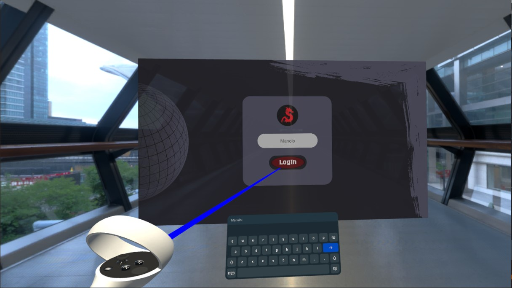

** Main Menu**  
The UI presents two options:
- **Create Room:** Ideal for starting a session, where the user creates a room for others to join.
- **Room List:** Displays active rooms, the number of users inside, the maximum allowed, and additional details. Users can join any available room.
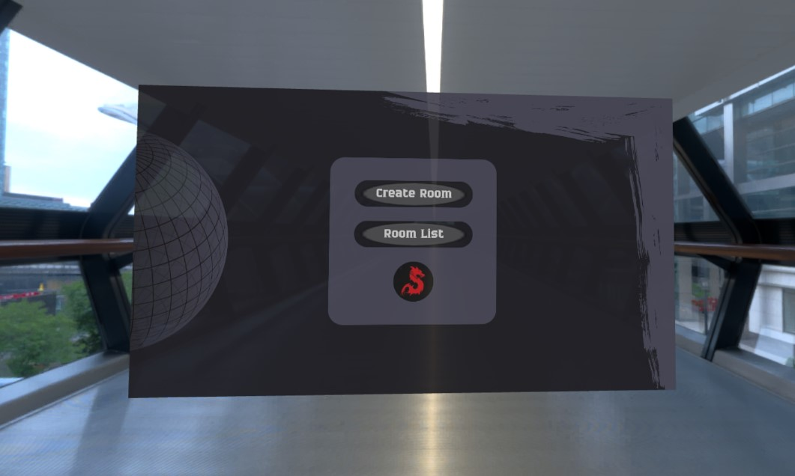

** Creating a Room**  
In this screen, the user provides the room name and the maximum number of allowed users. Options to create or cancel are available.
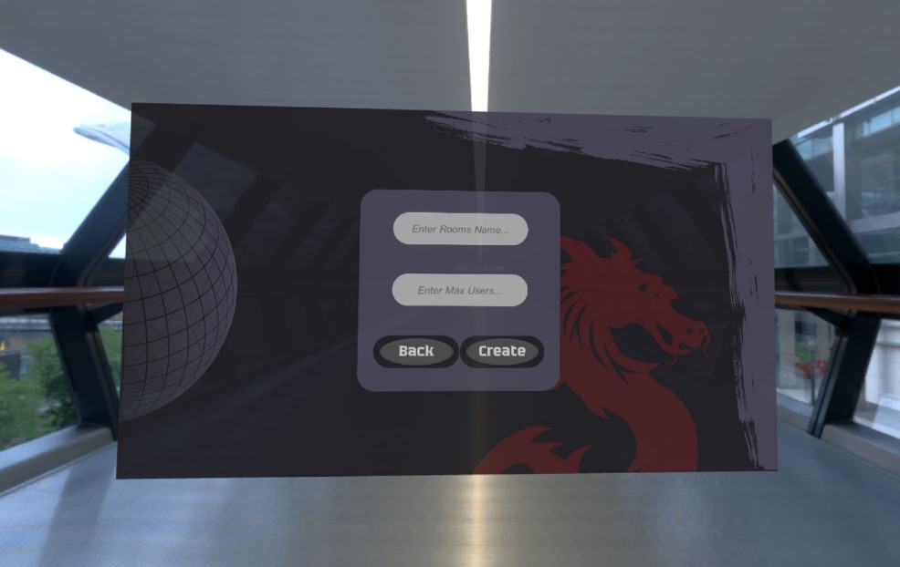

** Room List**  
Once a room is created, it appears in the Room List. For instance, "Manolo" is marked with a "Me" tag to identify the user, and "Usuario 2" is another user connected from a different location. Only the room creator can press "Play" to start the session with all users in the room.
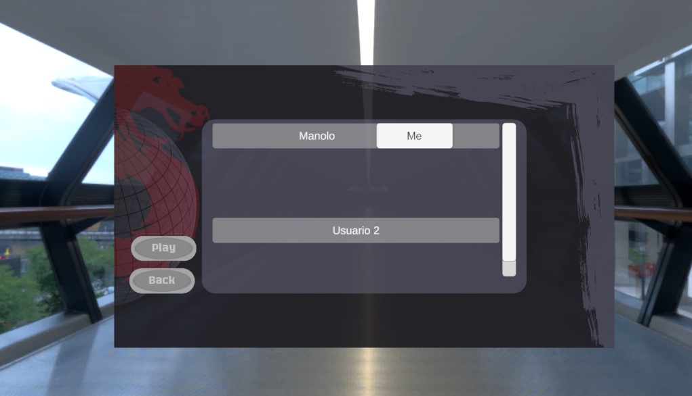

** Waiting Screen**  
A waiting screen with valuable information is shown, displaying connection status and other messages or warnings.
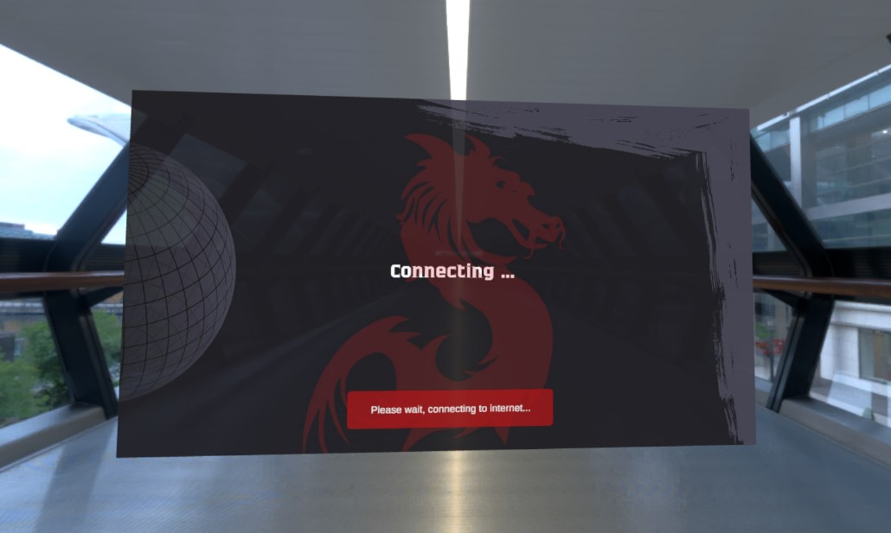

## Virtual Psychology Practice

To test the platform's functionality, a psychology practice session was conducted by assigning a case to the AI.

** Virtual Consultation Room**  
The virtual consultation room is incredibly realistic, featuring a carefully designed space, specifically chosen colors, and a detailed exterior. For more information on the psychology details, refer to the attached document in the GitHub repository.
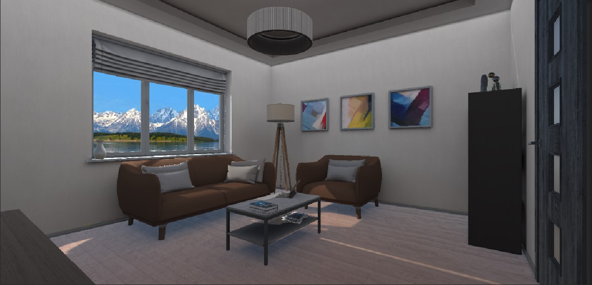
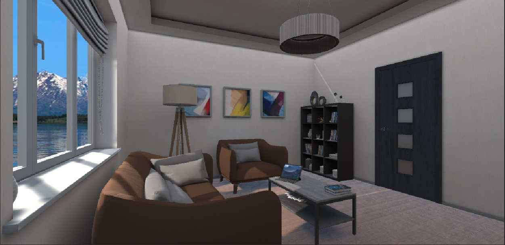
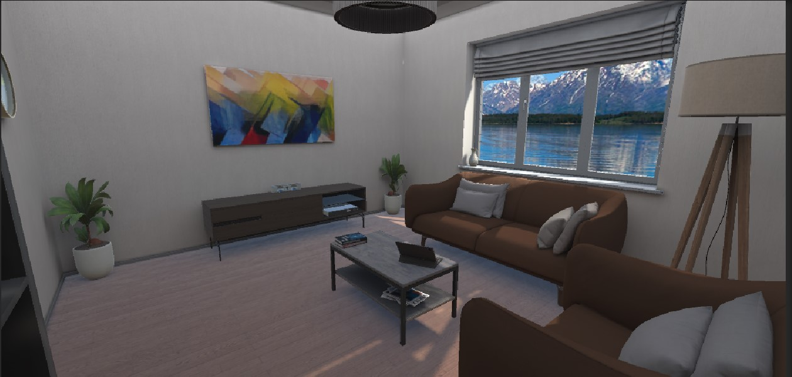
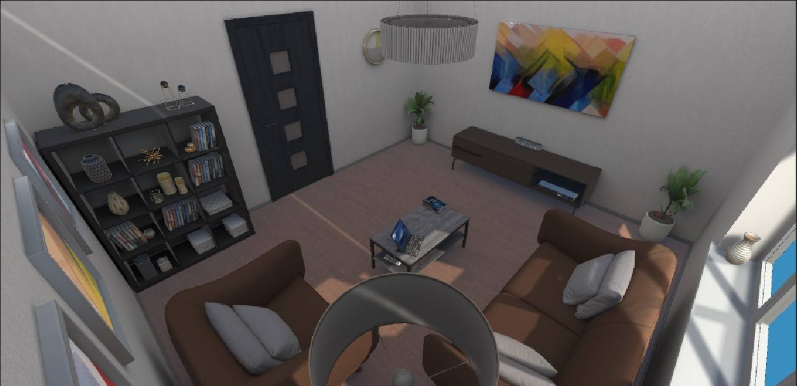

** Interaction with the AI**  
The student begins interacting with the AI, which simulates a human sitting in front of them, listening and responding, creating a risk-free environment for practice.
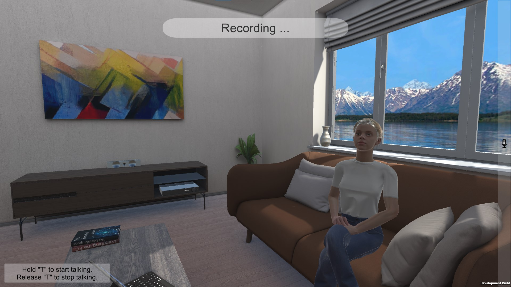

** Real-Time Conversation**  
The screen shows the text of what the user asked the AI (black text) and the AI's response (green text). The AI's movements simulate speech as we hear the response.
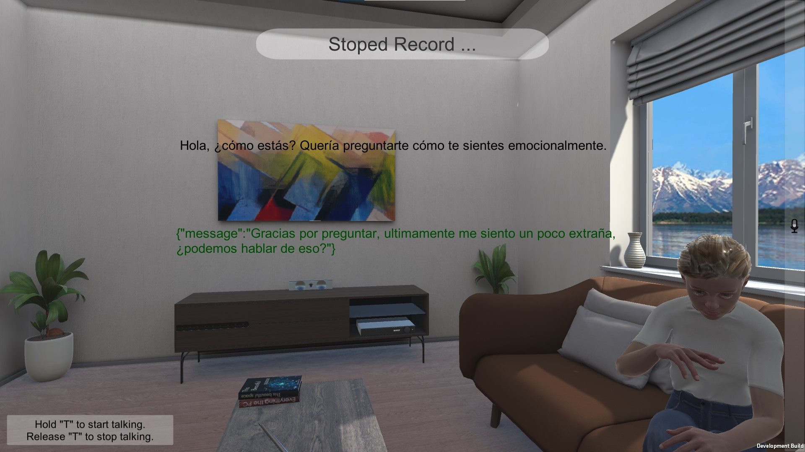

## Technical Details

### Solution Architecture Diagram
The illustration below demonstrates how each tool used in the platform's operation interrelates to provide a seamless and coherent user experience. The connections between components indicate the flow of data and control throughout the application, from user input to the final response, whether visual or auditory.

**Solution Architecture Overview**
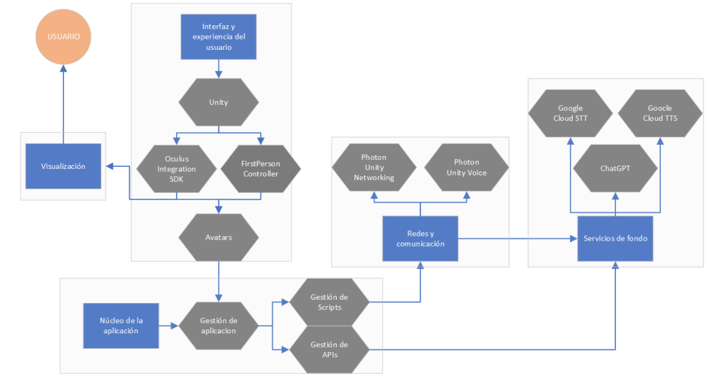

- **User Interface and Experience:**
  - **Oculus Integration SDK, FirstPersonController & Avatar:**
    These SDKs are used for avatar control and visualization in both the VR environment and a desktop environment. They allow users to move, interact, and communicate within the virtual world intuitively, leveraging the capabilities of VR headsets and computers.

- **Application Core:**
  - **API Management:**
    This component orchestrates the flow of data between various Google Cloud APIs and ChatGPT. It manages the sequence of calls and ensures that data is transferred correctly between services for transcription, processing, and voice synthesis.
  - **Script Management:**
    This core is the operational heart of the platform, ensuring that all system components function harmoniously and communicate efficiently. It includes specific 'Script Managers' responsible for individual operations within the application.

- **Networking and Communication:**
  - **Photon Unity Networking (PUN):**
    PUN manages the multi-user sessions within the application. It handles the code for creating virtual rooms and synchronizing states and events between users in the same scene, enabling a collaborative experience.
  - **Photon Voice:**
    Photon Voice provides the necessary code and infrastructure for real-time voice communication. Through this process, users can talk and be heard by other participants in the same VR session, similar to a live audio call.

- **Background Services:**
  - **Google Cloud Speech-to-Text API (STT):**
    This API is used to convert the voice captured by the Oculus headset microphones into text. This text is displayed on screen for the user to read and processed alongside the script management for other functions, such as sending this information to the ChatGPT API.
  - **ChatGPT API:**
    The ChatGPT API takes the transcribed text and generates an intelligent, contextual response. This text is displayed on screen for the user to read and processed alongside the script management for other functions, such as sending this information to the Google Cloud TTS API. This response can be used to interact with the user or answer questions.
  - **Google Cloud Text-to-Speech API (TTS):**
    The text response generated by ChatGPT is converted into audio by this API, allowing the response to be heard through the VR headset, creating a more natural and dynamic interaction.

### System Operation Diagram
The following diagram outlines how Photon Unity Networking manages the network, with PUN calls and callbacks facilitating connections, room operations, and state synchronization.

**System Operation Overview**
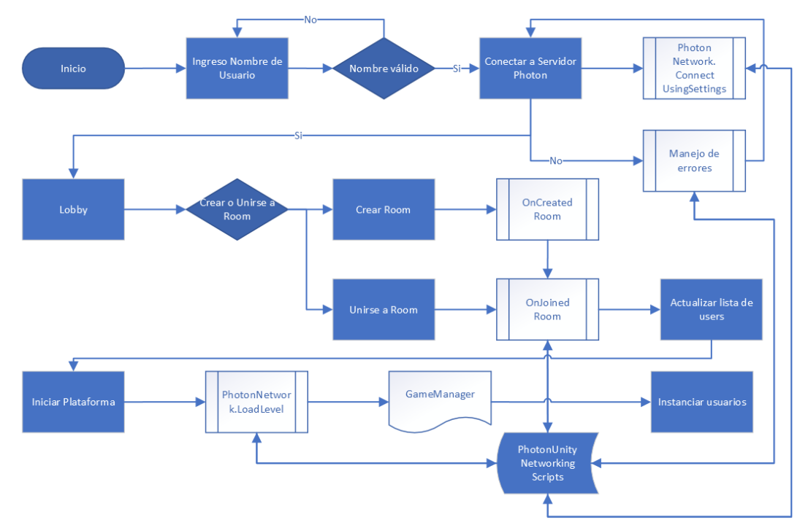

### Scene Operation Diagram
The diagram below illustrates how, when a scene loads, player avatars are instantiated, and key components for voice chat, transcription, voice synthesis, and interaction with ChatGPT AI are initiated. Each user has dedicated scripts that manage interactivity and communication within the game, enabling an immersive and connected user experience.

The diagram details the process from scene loading with `PhotonNetwork.LoadLevel` to user interaction within the game system. It includes avatar instantiation by the GameManager and voice communication management by PhotonVoiceManager. Connectivity and integration with external APIs like Google Cloud (STT and TTS) and OpenAI's ChatGPT are established for language processing. Specific SDKs are used for communication with these services.

- **UserSetUp and UserManager scripts** manage user configuration and interaction.
- **TextToSpeechManager and SpeechToTextManager** handle the conversion of voice to text and vice versa.
- The **user interface** displays dialogues and responses, facilitating real-time interaction.

**Scene Operation Overview**
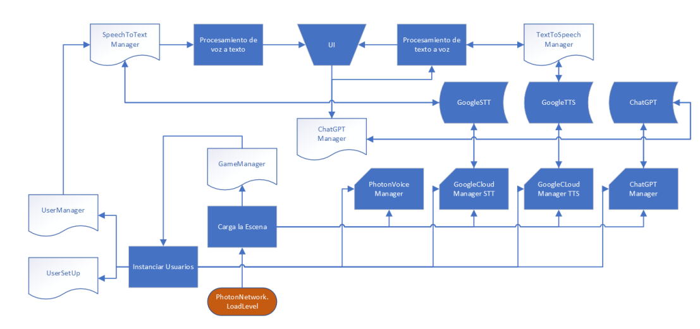

## Additional Information
For more detailed explanations and in-depth information about the project, please refer to the attached document in the GitHub repository. Note that the document is currently only available in Spanish. Additionally, there is a video that quickly demonstrates how the platform functions.

